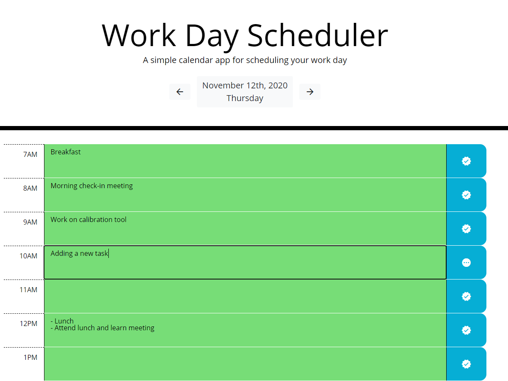

# Work Day Scheduler

## Approach/Enhancements
- I wanted to keep the structure and look of the mockup and starter code
- The page will update every ten minutes
- Some enhancements that I made
  - Instead of the app just displaying this current days agenda, the user can change the date to any present or future date and save tasks for that date
  - When a tasks value is changed, the savebutton icon changes to notify the user that they need to save the task

## Known Bugs
- When the user clicks the save button on a mobile phone, the icon remains black until the user clicks elsewhere
- The page reloads every 10 minutes and will delete and remove any unsaved progress
  - for example: if you start writing a task at the 9 minute 59 second mark, the textarea content will be deleted while you are typing

## Motivation
AS AN employee with a busy schedule\
I WANT to add important events to a daily planner\
SO THAT I can manage my time effectively

## Acceptance Criteria
*GIVEN I am using a daily planner to create a schedule*\
WHEN I open the planner\
THEN the current day is displayed at the top of the calendar\
WHEN I scroll down\
THEN I am presented with time blocks for standard business hours\
WHEN I view the time blocks for that day\
THEN each time block is color-coded to indicate whether it is in the past, present, or future\
WHEN I click into a time block\
THEN I can enter an event\
WHEN I click the save button for that time block\
THEN the text for that event is saved in local storage\
WHEN I refresh the page\
THEN the saved events persist
